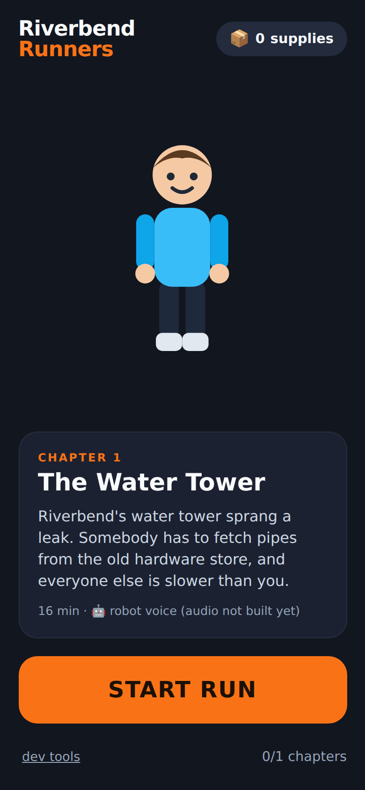
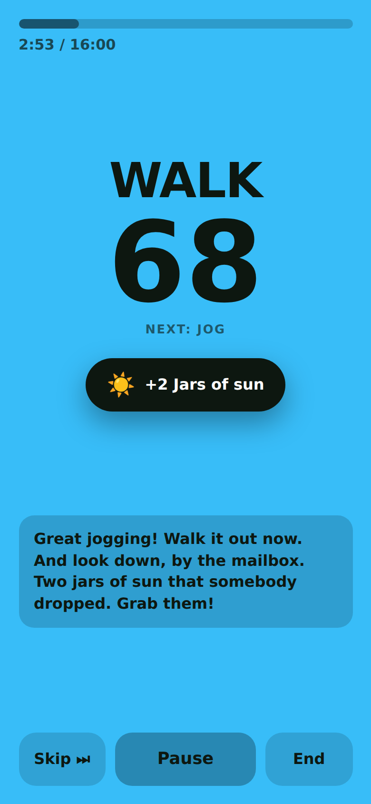
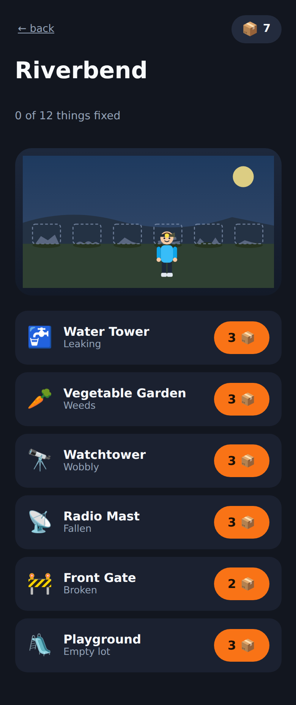

<div align="center">

# Riverbend Runners

**A story-driven interval running game for jogging with a six-year-old.**

Zombies chase you, you bring supplies home, and the town you're rebuilding
gets a little better after every run.

  

</div>

---

## What it is

A phone web app (no app store, no install) that narrates a story over a
run/walk interval workout. Each chapter is about 16 minutes, of which roughly
four are actual jogging. The story tells you when to run and when to walk, drops
supplies along the way, and hands you a piece of gear at some point in every
chapter.

The zombies are slow, clumsy, and mostly interested in your snacks. Nobody is
bitten, nobody is hurt, and every chapter ends safely back at base. The one place
it gets genuinely exciting is the sprint, where the screen turns red and Ruby on
the radio tells you to run to the end of the street.

**Two rewards, one screen.** Supplies are spent by the runner on rebuilding
Riverbend — the water tower, the garden, and eventually the playground. Gear is
never bought: the story just gives it to you, and the character on screen visibly
gains it. He stands in the town he's rebuilt, wearing what he's found.

## Quick start

**On a phone — use GitHub Pages.** Settings → Pages → Deploy from a branch, pick
the branch the app is on, folder **`/docs`**, Save. Wait a minute, then open the
site and use **Share → Add to Home Screen**.

If the site shows this README instead of the app, the folder is set to `/ (root)`.
There's a redirect at the repo root that handles that, but `/docs/` on the end of
the URL also works.

**On a computer — for editing, not for running outdoors:**

```bash
npx http-server docs -p 8000    # then http://localhost:8000
```

Serving over your LAN (`http://192.168.x.x:8000`) and opening that on the phone
*mostly* works, but it is not a secure context, so the browser silently withholds
two things the app depends on outdoors:

- **Wake Lock** — the screen sleeps mid-run. Before the audio is built that also
  stops the narration, because iOS suspends speech synthesis when the browser
  backgrounds.
- **Service worker** — no offline caching, so the run needs signal throughout.

Use the Pages URL for anything you actually jog with.

You can jog with it right away — before any audio has been generated, it falls
back to the phone's built-in text-to-speech. It sounds like a robot, and it stops
when the phone locks, but it works and the timing is real.

## Generating the story audio

Real audio is what makes this work properly on a run: **a chapter is one
pre-stitched mp3**, so the story keeps playing with the screen off and the phone
in a pocket, and the beat timing can't drift.

```bash
cp tools/.env.example tools/.env      # then paste in your OpenAI API key
brew install ffmpeg                   # used once, to encode the finished track

node tools/build-audio.mjs --chapter ch01
```

This reads the chapter script, generates each line with OpenAI text-to-speech,
lays the lines out at their authored offsets on a silent bed, pads the track to
exactly the length of the workout, and writes `ch01.mp3` alongside a
`ch01.timeline.json`. The app switches to the real audio automatically the next
time it loads — the timeline file's presence is how it decides.

The key is only ever used on your machine. It never goes near the browser or the
repo (`tools/.env` is gitignored).

Useful flags:

| Flag | What it does |
| --- | --- |
| `--dry-run` | Counts lines and characters. Calls nothing, bills nothing. |
| `--fake-voice` | Builds a real track with silence in place of narration, so you can check a chapter's pacing and that the script fits. Free. |
| `--all` | Every chapter in the pack. |
| `--force` | Regenerate lines that are already cached. |

A chapter script is a couple of thousand characters, so generating one costs
pennies. Check your OpenAI usage dashboard for current rates.

## Writing a chapter

Chapters are plain JSON in `docs/content/packs/riverbend/chapters/`. Nothing about
the story lives in JavaScript, so you can rewrite a line without touching code.

```jsonc
{
  "id": "ch02",
  "title": "The Radio Mast",

  // The workout. This is the source of truth for all timing.
  "intervals": [
    { "type": "warmup", "seconds": 120 },
    { "repeat": 3, "block": [
      { "type": "jog",  "seconds": 45 },
      { "type": "walk", "seconds": 75 }
    ]},
    { "type": "chase",    "seconds": 30 },
    { "type": "cooldown", "seconds": 120 }
  ],

  // Narration, placed at second offsets from the start of the run.
  "beats": [
    { "id": "b01", "at": 3, "voice": "ruby", "text": "Runner Two, do you copy?" },

    { "id": "b04", "at": 240, "voice": "ruby", "type": "supply",
      "item": "rope", "name": "Coil of rope", "count": 2,
      "text": "Rope, on the fence post. Grab it!" },

    { "id": "b09", "at": 520, "voice": "ruby", "type": "gear",
      "item": "boots", "name": "Fast Boots",
      "text": "Try these on. Nobody's catching you now." }
  ]
}
```

Interval types are `warmup`, `jog`, `walk`, `chase` and `cooldown`; each has its
own screen colour and its own spoken cue. Beat types are narration (the default),
`supply` (adds to the pile you spend on the base) and `gear` (unlocks a layer on
the character, permanently).

Then add the chapter to `chapters` in `pack.json`, and run the build script.

If two lines would talk over each other, the build script pushes the later one
back and warns you about it — the workout schedule itself never moves. If the
script simply doesn't fit in the workout, it refuses to build and says so.

## Dev tools

Tap **dev tools** on the home screen to get a panel on the run screen with 1×/2×/4×
speed and a **+60s** skip. A 16-minute chapter is testable in about a minute at the
kitchen table, which you'll want long before you want to test it outdoors.

`window.riverbend` in the console exposes the live session
(`riverbend.session.skip(60)`).

## Deploying

The app is static and lives in `docs/`, so GitHub Pages needs one setting:
**Settings → Pages → Deploy from a branch**, then pick the branch and folder
**`/docs`**. Pages will serve any branch, so there's nothing to merge first. Push,
wait a minute, and it's on a URL you can open on any phone.

The live link appears in a banner at the *top* of the Pages settings screen, and
only once the build has finished and you've reloaded — it never shows up next to
the branch picker, which is easy to miss on a phone. You can also watch the build
under the repo's Actions tab as *pages build and deployment*.

Two safeguards are in the repo so a wrong setting doesn't produce a broken site:
`index.html` at the root redirects to `docs/` when Pages is serving from `/ (root)`,
and `.nojekyll` files stop Pages from running the site through Jekyll.

This repo's default branch is `master`, not `main`.

## How it fits together

```
docs/
  index.html            all four screens; the app never navigates
  js/
    engine.js           the run: interval schedule, beat dispatch, chapter clock
    audio.js            two playback modes behind one interface
    app.js              screen routing and DOM wiring
    base.js  hero.js    the town and the character, drawn as SVG
    storage.js          one localStorage object; no accounts, no server
    packs.js            story pack loading
  content/packs/…       the story, as JSON and mp3s
  sw.js                 offline caching, so a jog needs no signal
tools/
  build-audio.mjs       chapter script -> stitched track + timeline
  wav.mjs               tiny WAV reader/writer used to assemble the track
```

The one decision everything else follows from: **the app doesn't keep its own
clock.** In story-audio mode the run clock *is* `audio.currentTime`, which is why
the story survives a locked screen. The fallback mode swaps in a wall clock behind
the same interface, and nothing else in the app knows the difference.

## Not done yet

- Chapters 2–6 of Riverbend (chapter 1 is written; the base has six structures to fill).
- Music beds. The player can take an optional loop per chapter; no audio is sourced yet.
- Adjustable interval lengths, for when four minutes of jogging stops being enough.
- GPS. Deliberately left out — at a six-year-old's pace the drift is larger than the
  signal, and a stalled story is worse than no map. It could be added as display-only
  stats without touching pacing.

## Privacy

There is no account, no server, and no analytics. Progress lives in `localStorage`
on the phone. No location is collected. The only network request is fetching the
app and its story files.

## Licence

MIT — see `LICENSE.txt`. Built on top of
[Best-README-Template](https://github.com/othneildrew/Best-README-Template);
the original template README is preserved as `BLANK_README.md`.
